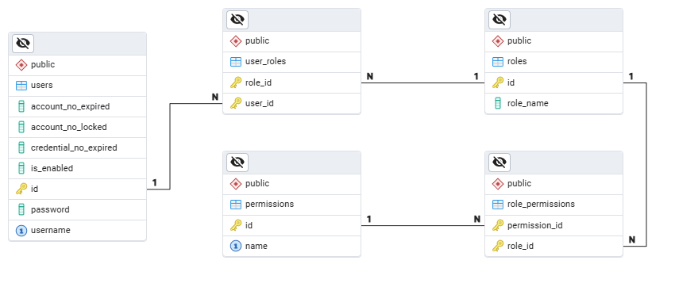
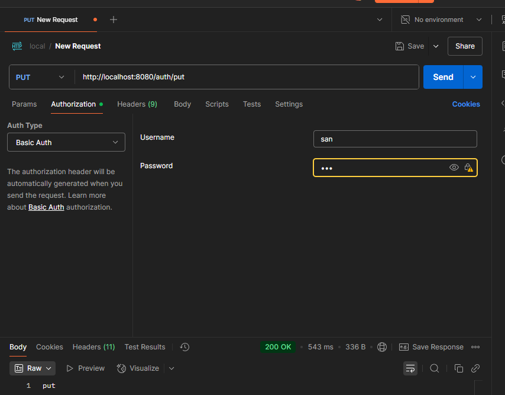
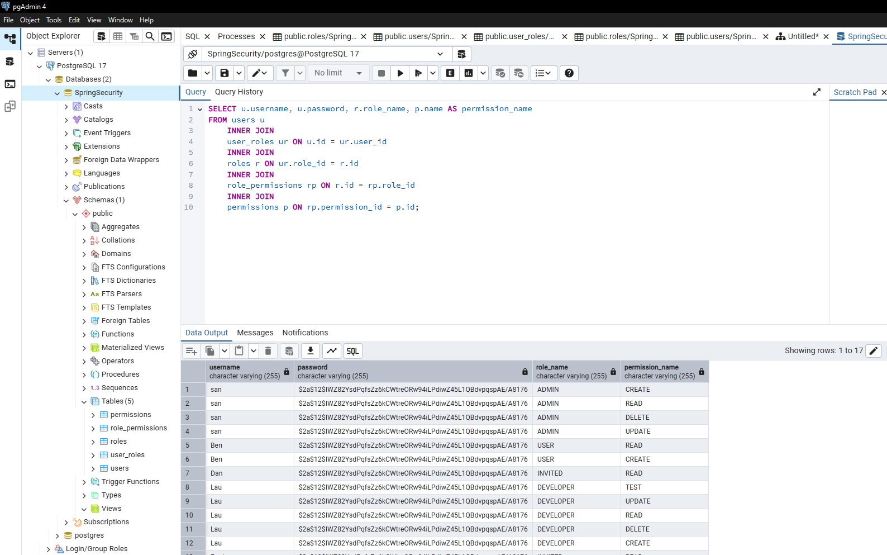

# 🛡 Spring Security 

Ejemplo practico de implementacion de Spring Security y visualizar la gestion de usuarios, roles y permisos, asi como el uso de BCrypt para contraseñas seguras, providers y filtros de seguridad personalizados.

---

## ⚙ Herramientas usadas: 
 - DataBase: **PostgreSQL**
 - Herramienta de Pruebas: **PostMan**

---
## 📚 Diagrama Entidad-Relacion

---

## 🧰 Postman

---

## 📖 Consultas

